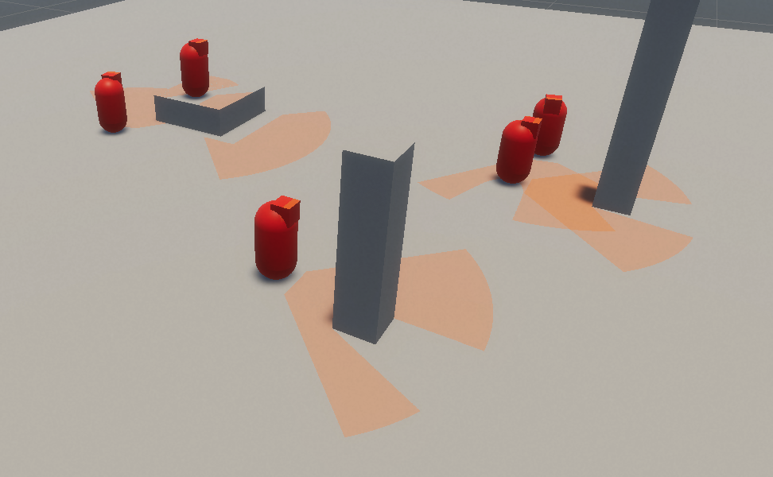
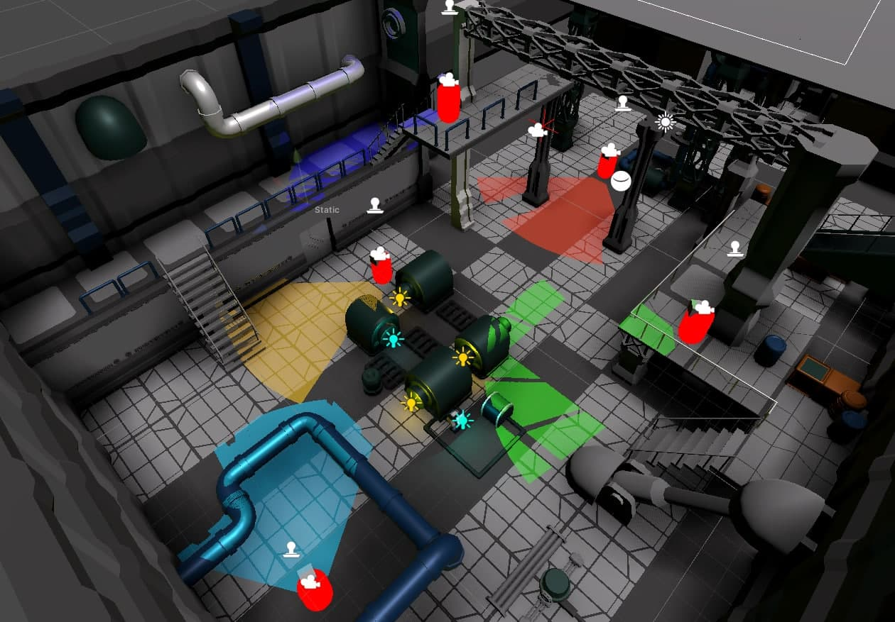

# Unity-HDRP-GPU-View-Cone
View Cone, Field of View, Sight Cone - done with custom Shadow Mapping in Unity HDRP

This Repository contains GPU View Cones for Unity HDRP.
Created in V2020.3.6f1, HDRP V10.4.0

Have a look at the example Scene and the "Enemy" Prefab - you can have as many view cones as you want to.
The performance cost should be like having a spotlight with shadows turned on.

> Example Scene

> Complex Scene, not included

The technique used is basically shadow mapping. Rendering the depth texture from the eyes of the enemy, then checking which spots are visible to the player AND the enemy and only drawing on overlapping pixels.

In order to exclude vertical faces (to only draw on the floor), you have to turn on [Decal Layers](https://docs.unity3d.com/Packages/com.unity.render-pipelines.high-definition@10.4/manual/Decal.html "DecalLayers") in the HDRP Asset and the Camera Frame Settings.

The shader is written in Shader Graph so you can customize it to your needs.

If you need to exclude or include specific layers (bushes where enemies can't see through for example) you can do this in the EnemyCamera -> CullingMask.

Have fun :)
